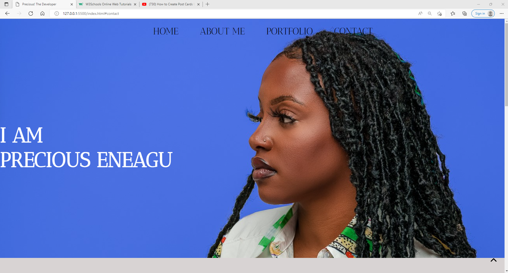
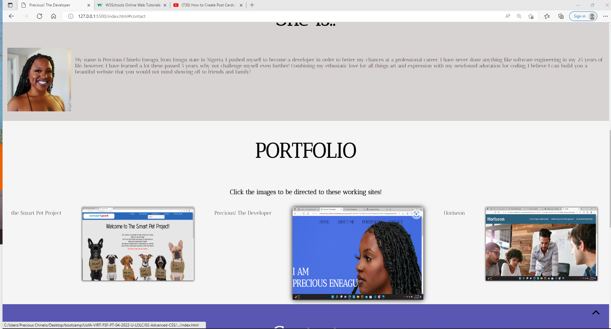
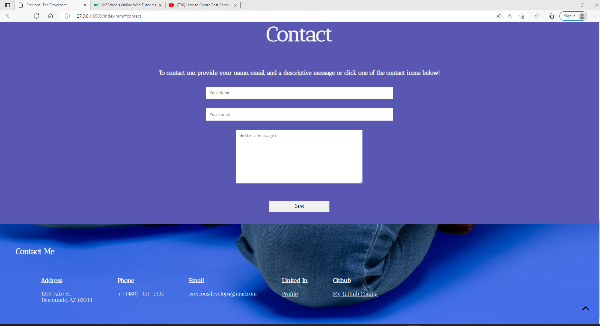

# # <Precious! The Developer>
## User Story

```
AS AN employer
I WANT to view a potential employee's deployed portfolio of work samples
SO THAT I can review samples of their work and assess whether they're a good candidate for an open position
```

## Acceptance Criteria

Here are the critical requirements necessary to develop a portfolio that satisfies a typical hiring manager’s needs:

```
GIVEN I need to sample a potential employee's previous work
WHEN I load their portfolio
THEN I am presented with the developer's name, a recent photo or avatar, and links to sections about them, their work, and how to contact them
WHEN I click one of the links in the navigation
THEN the UI scrolls to the corresponding section
WHEN I click on the link to the section about their work
THEN the UI scrolls to a section with titled images of the developer's applications
WHEN I am presented with the developer's first application
THEN that application's image should be larger in size than the others
WHEN I click on the images of the applications
THEN I am taken to that deployed application
WHEN I resize the page or view the site on various screens and devices
THEN I am presented with a responsive layout that adapts to my viewport
```

## Description

My motivations to create my portfolio as a developer is to showcase to myself and others what I can do. I wanted to prove to myself that it is within my scope. The problem this solves is I now have a prtfolio to showcase to future employers, family, friends, and others. I learned how to properly write HTML and CSS code. 

## Installation

What are the steps required to install your project? Provide a step-by-step description of how to get the development environment running.

## Usage

Provide instructions and examples for use. Include screenshots as needed.

    The nav bar contains 4 items: Home, About Me, Portfolio, and Contact. When you click on each item, it will bring you down to the corresponding part of the page. When you click the scroll to top button, it will bring you back to the top of the page. 

    ```md
    
    ```
    In the portfolio section, when you hover over each of my examples, that item will enlarge to notify the user of where they are. Each image is a link to each deployed page. 
    
    ```md
    
    ```
    The contact section allows for consumers and employers to write a brief message to myself in regards to the service they are needing. For a faster response, they can also reach me via the contact infomation displayed across the bottom of the page - or by visitng my Github or Linked in accounts. 

    ```md
    
    ```

